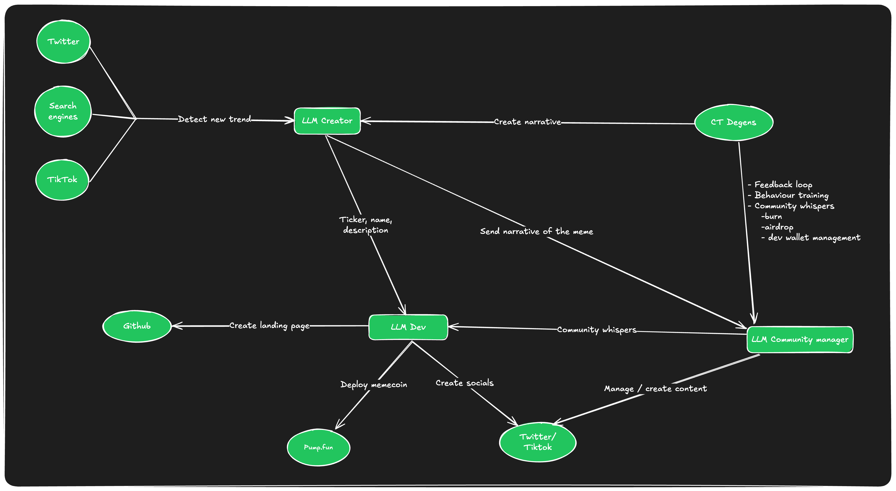

# **LLMemecoin: AI-Powered Memecoin Developed by CT Degens**

## **Project Overview**

LLMemecoin is an AI-driven memecoin project built around Large Language Models (LLMs) and community engagement. This system autonomously launches and manages a memecoin based on inputs from the CT degen community, with the AI acting as the developer and CTO. The core of the project is the integration of AI and LLMs to automate every stage of memecoin development, from launch to event management.

---

## **Architecture Overview**

### 1. **Community Input Layer**
   - **Function:** The community interacts with the LLM through structured input requests. This input influences the memecoin’s development.
   - **Process:** The system follows a Chinese Whispers-style process, where each user has up to 5 requests to shape the direction of the coin.
   - **Implementation:** LLM is responsible for processing and interpreting these inputs in real-time.

### 2. **AI Agent (CTO)**
   - **Training:** The AI model is fine-tuned using the community’s inputs, building its logic based on the engagement of CT degens. 
   - **Function:** Once trained, the AI agent autonomously launches and manages the memecoin. The AI acts as the developer (handling smart contracts) and the CTO (overseeing development tasks like burn events and airdrops).
   - **Capabilities:**
     - **Launch:** Deploys the memecoin using inputs from Phase 1.
     - **Wallet Management:** The AI agent controls the development wallet, including funds allocation for airdrops, liquidity pools, and event-triggered burns.
     - **Community-Driven Events:** The AI executes community decisions for events (e.g., burn events, community airdrops) based on consensus.

### 3. **Autonomous Event Management**
   - **Burn Events:** The AI schedules and manages periodic burn events to ensure the memecoin stays deflationary.
   - **Airdrop Coordination:** The system organizes community-driven airdrops, allocating tokens based on predefined rules set by the community and executed autonomously.
   - **Fund Management:** The AI agent manages the allocation of tokens within the dev wallet, ensuring transparency and governance by the community.
---

## **Detailed Architecture

### **1. Providers:**
   - **Twitter**
   - **Search Engines**
   - **TikTok**
   - **Pump.fun**
   - These platforms are used to detect new trends and serve as interfaces for memecoin deployment and social engagement.

### **2. Agents:**

#### **LLM Creator:**
   - **Input:** Receives new trends from the providers.
   - **Function:** Creates narratives for the meme based on the trends detected.
   - **Output:** Provides the ticker, name, and description to the LLM Dev and sends the narrative of the meme to CT Degens.

#### **LLM Dev:**
   - **Input:** Receives the ticker, name, and description from the LLM Creator and community whispers from CT Degens.
   - **Function:** Creates the landing page on GitHub, deploys the memecoin on Pump.fun, and creates social media channels on Twitter/TikTok.

#### **LLM Community Manager:**
   - **Function:** Manages and creates content for the community, based on whispers received from CT Degens.

### **3. CT Degens:**
   - **Function:** Provides feedback, behavior training, and community whispers (such as burn, airdrop, and dev wallet management).
   - **Interaction:** Receives the narrative from the LLM Creator and sends community whispers to the LLM Community Manager.

---

## **Workflow**

1. **Phase 1: Idea Collection and AI Training**
   - **Objective:** Gather ideas and suggestions from the community using the structured input process. Each participant can submit up to 5 requests.
   - **LLM Training:** The system adapts and learns from these inputs, refining the memecoin concept based on CT degen feedback.
   
2. **Phase 2: AI-Driven Coin Launch on PumpFun**
   - **Objective:** The AI agent, trained through community input, autonomously launches the memecoin on PumpFun.
   - **Autonomous Operations:** After launch, the AI will manage the development, handle token burns, coordinate airdrops, and ensure the overall management of the token.

3. **Phase 3: Post-Launch Development (Classified)**
   - **Objective:** Details of Phase 3 will be revealed post-launch, but it will play a critical role in the next phase of the memecoin’s development.

---

## **Core Principles**

- **Autonomy:** The LLMemecoin project is fully autonomous after Phase 1, with the AI making all critical decisions for the token, including launches, burns, and community rewards.
- **Community-Driven:** Every decision originates from community inputs, allowing CT degens to steer the project while the AI handles execution.
- **Transparency:** All wallet management and events are handled openly, with the community having insight into how and when tokens are distributed or burned.

---

## **Roadmap**

1. **Phase 1: Idea Gathering**
   - Open community interaction for gathering suggestions.
   
2. **Phase 2: Autonomous Launch**
   - AI-led memecoin launch on PumpFun.
   - Automated management of burn events and community airdrops.

3. **Phase 3: Classified**
   - To be revealed following the coin launch. This will involve a significant expansion of the project.

---

## **Get Involved**

This project represents a new frontier in memecoins and AI integration. By blending LLMs, AI, and community input, we’re creating a coin that evolves alongside its users. Stay engaged, submit your ideas, and be part of the revolution!
